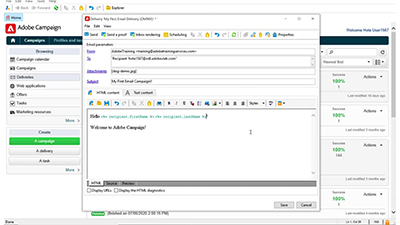

# Tutoriels sur la console cliente Adobe Campaign v8

Adobe Campaign offre une plateforme permettant de concevoir des expériences cross-canal pour les clientes et clients et propose un environnement pour l’orchestration visuelle des campagnes, la gestion d’interactions en temps réel et l’exécution cross-canal (Cross-channel Execution). Ce guide contient des vidéos et des tutoriels sur les nombreuses fonctionnalités de la console cliente Adobe Campaign v8.

Voir

>[!INFO]
> Avez-vous des questions ? Voulez-vous partager votre expérience ou échanger des idées avec vos pairs ? Ou avez-vous à formuler des commentaires concernant le contenu de formation pour l&#39;équipe d&#39;Adobe ? Rejoignez la conversation dans le [thread de la communauté d’apprentissage Adobe Campaign](https://experienceleaguecommunities.adobe.com:443/t5/adobe-campaign-classic/join-the-discussion-on-adobe-campaign-learning/td-p/419096) !
> 
> Vous ne trouvez pas ce que vous voulez dans ces tutoriels ?
> Consultez [Tutoriels sur l’interface d’utilisation d’Adobe Campaign Web](https://experienceleague.adobe.com/docs/campaign-web-learn/tutorials/overview.html?lang=fr) pour des conseils sur l’utilisation de l’interface d’utilisation de Campaign Web.

>[!NOTE]
> Actuellement, Campaign v8 n’est disponible qu’en tant que Cloud Service géré et ne peut pas être déployé dans des environnements On-premise ou hybrides. La migration automatisée depuis un environnement Campaign Classic v7 existant n’est pas encore disponible.
>
>Veuillez consulter la [documentation du produit](https://experienceleague.adobe.com/docs/campaign/campaign-v8/new/v7-to-v8.html?lang=fr) pour plus d’informations sur la transition de Classic v7 vers v8.

## Sélections du personnel

<table>
<tr>
  <td>
    
    

      <a href="/help/get-started/create-a-marketing-plan-programs-and-campaigns.md">
    <strong>Créer un plan marketing</strong>
    </a>
    

    

    <em>Découvrez comment créer un plan marketing, un programme et une campagne.</em>
    

  </td>
   <td>
    
    

      <a href="./content-creation/create-and-design-email-deliveries.md">
    <strong>Créer et concevoir des diffusions e-mail</strong>
    </a>
    

    

    <em>Découvrez le processus de création d’une diffusion e-mail et apprenez à concevoir et à personnaliser du contenu d’e-mail.
</em>
    

  </td>
  <td>
    
    

      <a href="./send-messages/fatigue-management/typology-rules-for-fatigue-management.md">
    <strong>Gérer la lassitude à l’aide de règles de typologie</strong>
    </a>
    

    

    <em>Découvrez comment implémenter la gestion de la lassitude dans Adobe Campaign à l’aide de règles de typologie. </em>
    

  </td>
</tr>
<tr>
</td>
  <td>
    
    

      <a href="./reporting/generate-a-descriptive-analysis-report.md">
    <strong>Générer un rapport d’analyse descriptive</strong>
    </a>
    

    

    <em>Découvrez comment générer un rapport d’analyse descriptive à partir d’un workflow.</em>
    

  </td>
  <td>
   
     

      <a href="./data-management/data-management-fundamentals.md">
    <strong>Principes fondamentaux de la gestion des données avec les workflows</strong>
    </a>
    

    

    <em>Découvrez ce que sont les dimensions de ciblage et les tableaux de travail, ainsi que la manière dont Adobe Campaign gère les données entre différentes sources de données.</em>
    

  </td>
  <td>
   
     

      <a href="./data-management/api-staging-mechanism.md">
    <strong>Mécanisme d’évaluation des API avec FFDA</strong>
    </a>
    

    

    <em>Découvrez comment fonctionne le mécanisme d’évaluation des API avec Full FDA.</em>
    

  </td>
</tr>
</table>

