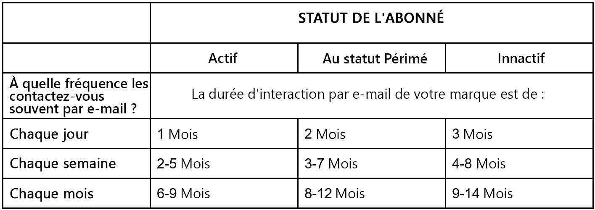

# RSI des emails et bonnes pratiques pour le réengagement des abonnés

Le marketing par e-mail est un outil précieux pour développer la fidélité à la marque et augmenter les ventes. Cependant, avec le grand nombre d&#39;emails que les gens reçoivent chaque jour, sans parler des autres contenus numériques qu&#39;ils consomment, il est important que votre contenu se distingue de la foule. Et il est important qu&#39;il réponde aux besoins uniques de votre public.

Dans cet article, nous passerons en revue quatre stratégies pour améliorer l’engagement de vos abonnés et le succès global de vos campagnes par e-mail. Nous discutons également de la fatigue des emails, de la manière de l’identifier au sein de vos audiences, ainsi que des étapes simples à suivre pour améliorer l’expérience de vos abonnés.

## Qu’est-ce que la délivrabilité ?

Il peut y avoir une confusion entre les termes diffusion et délivrabilité. La délivrabilité est une mesure du succès des campagnes par e-mail. s’ils sont diffusés dans la boîte de réception de l’abonné, dans le dossier junk ou bloqués par le FAI. Si nous le considérions comme une équation, ce serait l&#39;action d&#39;envoyer un email + la capacité d&#39;atterrir dans la boîte de réception + la capacité de le faire en continu.

Dans quelle mesure votre organisation suit-elle la délivrabilité de vos campagnes par e-mail et savez-vous où se terminent vos e-mails ?

## Filtrage des messages indésirables

Avant de passer à la stratégie, il est important de connaître les problèmes de filtre anti-spam les plus courants qui peuvent affecter les résultats de votre campagne. Si vous continuez à envoyer des emails aux abonnés inactifs qui n’ouvrent pas vos emails, voici pendant plus d’un an ce que vous pouvez rencontrer :

* Listes bloquées et listes autorisées
* Filtres de contenu
* réputation des adresses IP et des domaines
* Authentification
* Plaintes
* Actions des utilisateurs

## Optimisation du ROI de votre email

Saviez-vous qu&#39;en seulement une minute sur Internet, il y a plus d&#39;un million de vues vidéo, deux millions de requêtes de recherche Google, six millions de vues Facebook et 200 millions d&#39;emails envoyés ? Avec tant de choses qui se passent, il est important de s&#39;assurer que votre contenu ne se perde pas dans le bruit. En particulier si vous créez une campagne pendant les vacances, il est encore plus difficile d’envoyer vos emails aux clients potentiels et récurrents.

De novembre à début janvier, le volume des emails marketing envoyés augmente de manière significative. Les fournisseurs de messagerie (FAI) auront beaucoup plus de trafic sur leurs serveurs qu&#39;au cours du reste de l&#39;année et seront donc encore plus vigilants quant à la protection de leurs clients (vos abonnés).

Voici quatre stratégies clés pour optimiser votre retour sur investissement :

### 1. Préparez votre calendrier de contenu

* Les FAI effectuent le suivi de votre moyenne d’envoi à partir d’une adresse IP, distribuez donc le volume autant que possible pour éviter de créer un indicateur rouge et de l’envoyer aux spams.
* Configurez votre calendrier de contenu à l’avance et préparez les auteurs de contenu à une augmentation du volume d’envoi.
* Pensez à la façon dont vous planifiez vos emails et évitez un pic de volume d’envoi. Prenez quelques tactiques, telles que :
   * Pas d&#39;envoyer une explosion en même temps, mais plutôt sur quelques jours
   * Planifiez stratégiquement en fonction des heures de la journée où les personnes reçoivent la surcharge d’emails, telles que 8-10h
   * Si vous ne pouvez pas l&#39;étaler sur plusieurs jours, essayez pendant des heures.

### 2. Infrastructure

* Assurez-vous que l’authentification par courrier électronique est correctement configurée en effectuant un test avec votre propre courrier électronique.
* Familiarisez-vous avec la gestion des bounces et vérifiez les performances sur tous vos FAI.
   * Existe-t-il des problèmes ou des blocs potentiels avec un FAI spécifique ?
   * Connaître vos problèmes avant de commencer à envoyer un volume élevé afin d’éviter les mauvaises surprises et les mauvaises performances de la campagne

### 3. Données

* Identifiez toutes les techniques d’acquisition, en particulier vos processus d’inscription et le RGPD.
* Soyez aussi transparent que possible avec vos abonnés lorsque vous demandez leur adresse email :
   * Quel contenu allez-vous envoyer (newsletter, promotions, événements) ?
   * Combien d&#39;emails allez-vous envoyer (quotidien, hebdomadaire, mensuel) ?

* Envoyer un email de bienvenue aux nouveaux abonnés :
   * Les e-mails de bienvenue permettent de s’assurer que les abonnés ne sont pas aveuglés par le nouveau contenu et ne se désabonnent pas ou ne se signalent pas comme spam.
   * Les emails de bienvenue constituent également un bon indicateur de performances. S&#39;ils ne sont pas livrés avec succès ou n&#39;interagissent pas avec eux, vous savez que c&#39;est un signe de mauvaises performances ou de mauvaise collecte de données.

### 4. Gestion des emails

* Segmenter vos abonnés et surveiller où ils se trouvent dans le cycle de vie de votre marque
* Utiliser des stratégies de personnalisation du contenu pour améliorer la pertinence de vos emails

## Comment augmenter l’engagement des emails et résoudre la fatigue des emails

La fatigue liée aux emails se produit lorsque vos abonnés en ont assez de recevoir vos emails. La fatigue des emails peut survenir pour plusieurs raisons. peut-être qu&#39;ils sont sur votre liste depuis trop longtemps et qu&#39;ils en ont assez d&#39;avoir de vos nouvelles ou que votre contenu le plus récent n&#39;est plus pertinent. C’est à vous et à votre équipe de déterminer quels clients sont lassés de leurs emails et pourquoi. Quels sont les signes à surveiller ?

Les mesures clés à surveiller sont les suivantes :

* Taux d’ouverture plus bas
* Taux de clics inférieurs
* Taux de désabonnement plus élevés

Malheureusement, la plupart des abonnés qui souffrent de fatigue d’email ne vous faciliteront pas les choses. Ils ne se désabonneront pas eux-mêmes, un drapeau clair indiquant qu&#39;ils ne sont pas satisfaits du contenu. Nombre d’entre eux suppriment simplement vos emails ou les ignorent, de sorte que vous pouvez toujours voir les ouvertures d’abonnés qui ne sont pas engagés. L&#39;important est que si vous ne réagissez pas aux changements d&#39;habitudes de vos abonnés, cela peut nuire à la réputation de votre expéditeur, ce qui finit par nuire à votre succès global.

C’est dans cette optique que vous trouverez ci-dessous quelques bonnes pratiques pour maintenir l’engagement de vos abonnés et anticiper le type de contenu qu’ils souhaitent recevoir, afin d’éviter les désabonnements et les audiences inactives.

### 1. Créez une stratégie pour la fréquence des emails

Malheureusement, il n&#39;existe pas de réponse correcte sur le nombre d&#39;emails à envoyer par semaine. Pour trouver le bon nombre, tenez compte des éléments suivants :

* Où se trouve votre client dans le cycle de vie du client ?
* À quel point vos emails sont-ils interactifs ?
   * Abandon de panier par email ou newsletter
   * Email de réactivation/lancement de vente
   * Email d’abandon de panier par rapport au lancement d’un nouveau produit
* Quelle est la capacité de votre client à recevoir du contenu de votre marque ?
* Quelles sont les préférences saisonnières de vos clients ?

### 2. Identifier l&#39;état de vos abonnés

L’état de vos abonnés (principal, obsolète ou inactif) dépend de la fréquence à laquelle vous leur envoyez du contenu. De là, vous pouvez déterminer leur engagement.

Voici un tableau simple pour vous aider lors de votre audit :

Si, par exemple, vous envoyez un courrier électronique quotidien à des clients, ils doivent avoir interagi avec l’un de ces courriers électroniques au cours du dernier mois pour être considérés comme principaux et engagés. A l’inverse, si vous envoyez un courrier électronique aux clients tous les mois et qu’ils n’ont pas interagi dans les 9 à 14 mois, ils peuvent être considérés comme inactifs.

Pour les utilisateurs déconseillés ou inactifs, pensez à la date à laquelle l’utilisateur s’est abonné afin de déterminer son niveau d’engagement. Par exemple, ont-ils souscrit à la date d&#39;un concours ou d&#39;une autre campagne marketing ? Se sont-ils inscrits dans une fenêtre contextuelle de site web avec une offre de réduction ? Une fois que vous avez identifié vos utilisateurs obsolètes et inactifs, il est important de modifier votre stratégie afin d’améliorer leur satisfaction et de les transformer en un principal abonné.

### 3. Mettre en oeuvre des stratégies de réengagement

Ventilez ce processus en deux zones d’intérêt : a) modèles d’envoi d’emails et b) contenu créatif des emails eux-mêmes. Voici un aperçu plus détaillé de chacune de ces zones :

**Mise à jour des modèles et des plannings d’envoi**

* **Démarrer lentement** - C&#39;est un marathon pas un sprint. Ce n’est pas une solution que vous pouvez mettre en oeuvre en un jour. Pensez à commencer par un petit pourcentage de votre audience, environ 4-5 %, et à surveiller soigneusement les performances.

* **Considérer la réputation de la marque** - Assurez-vous que le trafic de courrier électronique vers les segments inactifs ne pose aucun problème de réputation.

* **Automatiser les workflows** - Gardez vos listes propres et ordonnées.

* **Règles de pression** - Exclure les abonnés du programme de réengagement de la réception de tout autre courrier électronique.

**Création et contenu**

* **Offrir une inclusion/exclusion claire** - Facilitez pour les utilisateurs la possibilité de décider rapidement s’ils souhaitent avoir de vos nouvelles. Vous pourriez recevoir une souscription pour avoir pris en compte d’abord leurs besoins, plutôt que de vous concentrer sur les besoins de l’entreprise en matière d’engagement.

* **Créer un centre de préférences** - Il est possible de donner un contrôle supplémentaire à vos abonnés, ce qui leur permet de choisir parmi différents contenus d&#39;email tels que des newsletters, des offres promotionnelles, des événements, etc., ainsi qu&#39;une régularité différente. Souvenez-vous que si vous décidez de proposer cette offre, veillez à suivre et à segmenter correctement votre audience pour répondre à ces préférences.

* **Lignes d’objet fortes** - Assurez-vous qu’elles se démarquent des autres contenus de marque

* **Tester et apprendre** - un bon plan de test est important pour vous assurer que vos efforts ont l’effet escompté. Découvrez ce qui fonctionne et ce qui ne fonctionne pas et itérez en conséquence.

Pour un résumé de cet article et une démonstration en direct de la mise en oeuvre des stratégies de réengagement, regardez notre [webinaire](https://adobecustomersuccess.adobeconnect.com/pm8goho13xuy/).
