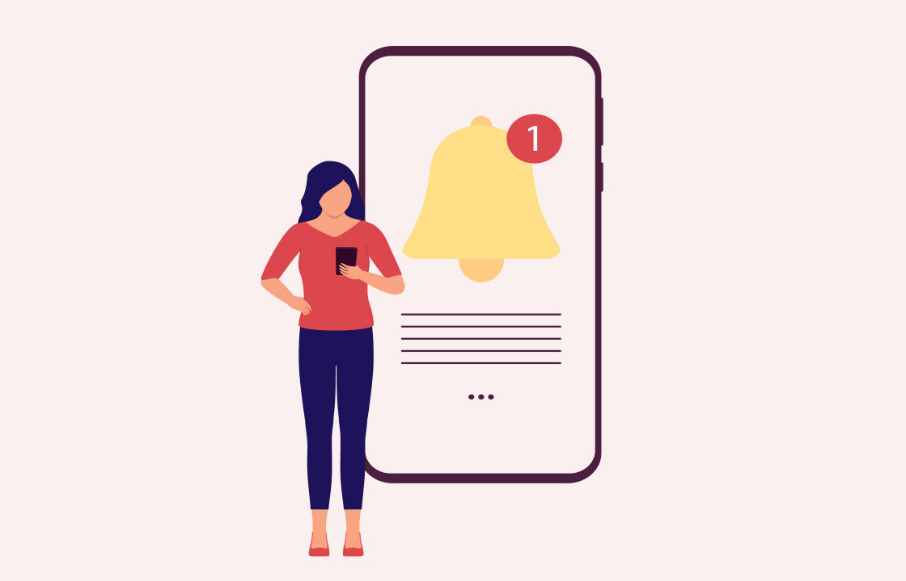
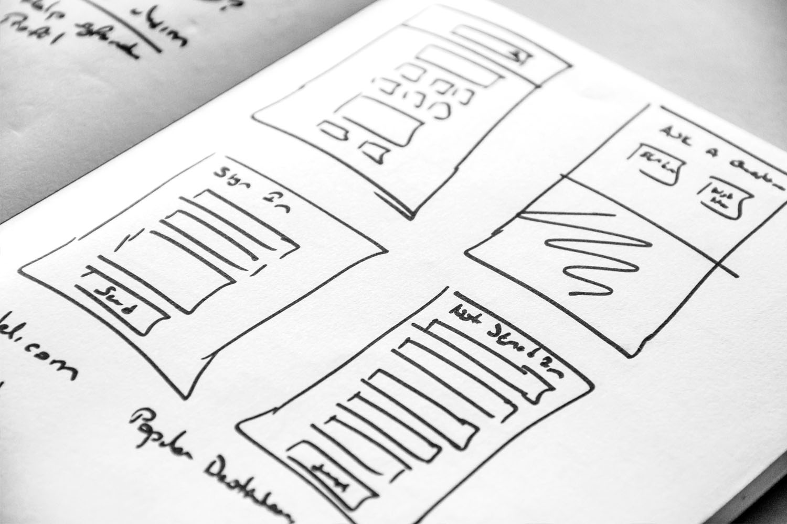

# Commencer pour les spécialistes du marketing

Ce guide offre une vue d’ensemble des principales fonctionnalités de Campaign v8. Il est destiné aux spécialistes du marketing qui migrent de Campaign Standard vers Campaign v8.

Vous pouvez accéder à Adobe Campaign v8 à partir de la console cliente ou de l’interface d’utilisation web. L’interface web vous permet de créer, de gérer et d’exécuter des actions marketing clés.

>[!NOTE]
> Les mises à jour de l’interface d’utilisation d’Adobe Campaign Web fonctionnent sur un modèle de diffusion continue qui permet une approche plus évolutive et plus progressive du déploiement des fonctionnalités. Consultez régulièrement les [notes de mise à jour](https://experienceleague.adobe.com/fr/docs/campaign-web/v8/release-notes/release-notes) pour connaître les dernières mises à jour.

## Accéder à l’interface d’utilisation de Campaign Web et l’explorer

>[!VIDEO](https://video.tv.adobe.com/v/3427278?quality=12&learn=on){transcript=true}

* [Découvrir l’interface](https://experienceleague.adobe.com/fr/docs/campaign-web/v8/start/user-interface)
* [Parcourir et filtrer la liste](https://experienceleague.adobe.com/fr/docs/campaign-web/v8/start/list-filters)

## Rechercher de l’aide et des conseils

[Documentation de l’interface utilisateur web d’Adobe Campaign](https://experienceleague.adobe.com/fr/docs/campaign-web/v8/campaign-web-home)

## Créer et gérer des profils et des audiences

### Gérer des audiences

Le concept général de création et de gestion des audiences dans Campaign v8 est le même que dans Adobe Campaign Standard.

#### Profils

Découvrez comment accéder aux profils, les gérer et les explorer à l’aide de l’interface d’utilisation de Campaign Web.

>[!VIDEO](https://video.tv.adobe.com/v/3427293?quality=12&learn=on){transcript=true}

Consultez [Commencer avec les profils](https://experienceleague.adobe.com/fr/docs/campaign-web/v8/audiences/work-with-profiles/about-recipients){target="_blank"} pour plus d’informations.

#### Audiences

Découvrez comment créer et gérer des audiences, comment sélectionner des audiences pour une diffusion et définir des populations témoins.

>[!VIDEO](https://video.tv.adobe.com/v/3425861?quality=12&learn=on){transcript=true}

Pour plus d’informations, consultez [Commencer avec les audiences](https://experienceleague.adobe.com/fr/docs/campaign-web/v8/audiences/audiences/manage-audience){target="_blank"}.

### Profils de test

[Créer et gérer des profils de test](https://experienceleague.adobe.com/fr/docs/campaign-web/v8/audiences/work-with-profiles/test-profiles){target="_blank"}

### Gérer les abonnements

Utilisez Adobe Campaign Web pour gérer et créer vos services tels que les newsletters, ainsi que pour vérifier les abonnements et désabonnements relatifs à ces services. En savoir plus :

<table style="table-layout:fixed"><tr style="border: 0;">
<td>

<a href="https://experienceleague.adobe.com/fr/docs/campaign-web/v8/audiences/work-with-services/manage-services"><strong>Créer des services d’abonnement</strong></a>

</td>
<td>

<a href="https://experienceleague.adobe.com/fr/docs/campaign-web/v8/audiences/work-with-services/manage-subscribers"><strong>Gérer des personnes abonnées<strong></strong></a>

</td>
<td>

<a href="https://experienceleague.adobe.com/fr/docs/campaign-web/v8/msg/send-to-subscribers"><strong>Envoyer des messages aux personnes abonnées à un service</strong></a>

</td>
</tr>
</table>

## Créer et gérer des workflows et des campagnes cross-canal

### Commencer avec les campagnes

Pour commencer avec les [campagnes](https://experienceleague.adobe.com/fr/docs/campaign-web/v8/campaigns/gs-campaigns), consultez la documentation du produit.

### Création dʼun workflow

1. Découvrez le fonctionnement des workflows et comment créer un workflow de ciblage.

   >[!VIDEO](https://video.tv.adobe.com/v/3425873?quality=12&learn=on){transcript=true}

1. [Utiliser les activités de workflow](https://experienceleague.adobe.com/fr/docs/campaign-web/v8/wf/design-workflows/about-activities){target="_blank"}
1. [Mécanismes de sécurisation et limitations des workflows](https://experienceleague.adobe.com/fr/docs/campaign-web/v8/wf/guardrails){target="_blank"}

## Créer et gérer des diffusions

### Diffusion par e-mail

Découvrez comment créer entièrement une diffusion par e-mail, définir l’audience, concevoir le contenu, simuler l’aperçu et envoyer un BAT.

>[!VIDEO](https://video.tv.adobe.com/v/3425866?quality=12&learn=on){transcript=true}

#### &#x200B;1. Concevoir et définir du contenu

Découvrez comment naviguer dans le Concepteur d’e-mail. Découvrez comment structurer et concevoir entièrement un e-mail, et personnaliser et tester votre e-mail.

>[!VIDEO](https://video.tv.adobe.com/v/3425867?quality=12&learn=on){transcript=true}

Découvrez comment créer un e-mail en chargeant un fichier HTML, le rendre compatible avec le concepteur d’e-mail et le convertir en modèle.

>[!VIDEO](https://video.tv.adobe.com/v/3427633?quality=12&learn=on){transcript=true}

#### &#x200B;2. Prévisualiser et tester

Découvrez comment prévisualiser le contenu et la personnalisation des e-mails, envoyer des diffusions de test (BAT), ou encore vérifier le rendu des e-mails dans les clients populaires de bureau, mobiles et web.

>[!VIDEO](https://video.tv.adobe.com/v/3425862?quality=12&learn=on){transcript=true}

#### &#x200B;3. Envoyer un e-mail et consulter les logs

<!--
CARDS
   * https://experienceleague.adobe.com/fr/docs/campaign-web/v8/msg/email/monitor/prepare-send
   * https://experienceleague.adobe.com/fr/docs/campaign-web/v8/msg/email/monitor/schedule-sending
   * https://experienceleague.adobe.com/fr/docs/campaign-web/v8/msg/email/monitor/delivery-logs
-->
<!-- START CARDS HTML - DO NOT MODIFY BY HAND -->

    

        

            

                <figure class="image x-is-16by9">
                    
                </figure>
            

            

                

                    

                        <a href="https://experienceleague.adobe.com/fr/docs/campaign-web/v8/msg/email/monitor/schedule-sending" target="_blank" rel="referrer" title="Planifier l’envoi d’une diffusion">Planifier l’envoi d’une diffusion</a>
                    

                    
Apprendre à planifier une diffusion

                

                <a href="https://experienceleague.adobe.com/fr/docs/campaign-web/v8/msg/email/monitor/schedule-sending" target="_blank" rel="referrer" class="spectrum-Button spectrum-Button--outline spectrum-Button--primary spectrum-Button--sizeM" style="align-self: flex-start; margin-top: 1rem;">
                    En savoir plus
                </a>
            

        

    

    

        

            

                <figure class="image x-is-16by9">
                    
                </figure>
            

            

                

                    

                        <a href="https://experienceleague.adobe.com/fr/docs/campaign-web/v8/msg/email/monitor/delivery-logs" target="_blank" rel="referrer" title="Surveiller les logs de diffusion">Surveiller les logs de diffusion</a>
                    

                    
Découvrez comment surveiller les logs de diffusion.

                

                <a href="https://experienceleague.adobe.com/fr/docs/campaign-web/v8/msg/email/monitor/delivery-logs" target="_blank" rel="referrer" class="spectrum-Button spectrum-Button--outline spectrum-Button--primary spectrum-Button--sizeM" style="align-self: flex-start; margin-top: 1rem;">
                    En savoir plus
                </a>
            

        

    

<!-- END CARDS HTML - DO NOT MODIFY BY HAND -->

### Diffusion SMS

<table style="table-layout:fixed"><tr style="border: 0;">
<td>

<a href="https://experienceleague.adobe.com/fr/docs/campaign-web/v8/msg/sms/create-sms"><strong>Créer une diffusion SMS</strong>

</td>
<td>

<a href="https://experienceleague.adobe.com/fr/docs/campaign-web/v8/msg/sms/content-sms"><strong>Concevoir une diffusion SMS<strong></strong></a>

</td>
<td>

<a href="https://experienceleague.adobe.com/fr/docs/campaign-web/v8/msg/sms/send-sms"><strong>Prévisualiser et envoyer une diffusion par SMS</strong></a>

</td>
</tr></table>

### Créer et gérer des notifications push

Adobe Campaign v8 prend en charge le canal de notification push Android™ et iOS. Pour effectuer la transition des workflows et des diffusions existants qui utilisent le canal de notification push, contactez la personne responsable de la transition Adobe Campaign.

<table style="table-layout:fixed"><tr style="border: 0;">
<td>

<a href="https://experienceleague.adobe.com/fr/docs/campaign-web/v8/msg/push/create-push"><strong>Créer une diffusion de notification push</strong>

</td>
<td>

<a href="https://experienceleague.adobe.com/fr/docs/campaign-web/v8/msg/push/content-push"><strong>Concevoir une diffusion de notification push<strong></strong></a>

</td>
<td>

<a href="https://experienceleague.adobe.com/fr/docs/campaign-web/v8/msg/push/send-push"><strong>Prévisualiser et envoyer une diffusion push</strong></a>

</tr></table>

### Canal Courrier

1. [Créer une diffusion par courrier](https://experienceleague.adobe.com/fr/docs/campaign-web/v8/msg/direct-mail/create-direct-mail)
2. [Définir le contenu](https://experienceleague.adobe.com/fr/docs/campaign-web/v8/msg/direct-mail/content-direct-mail){target="_blank"}
3. [Prévisualiser et envoyer](https://experienceleague.adobe.com/fr/docs/campaign-web/v8/msg/direct-mail/send-direct-mail){target="_blank"}

### Bonnes pratiques de diffusion

* [Utiliser des modèles de diffusion](https://experienceleague.adobe.com/fr/docs/campaign-web/v8/msg/delivery-template){target="_blank"}

## Créer et gérer des landing pages

<table style="table-layout:fixed"><tr style="border: 0;">
<td>

<a href="https://experienceleague.adobe.com/fr/docs/campaign-web/v8/landing-pages/create-lp"><strong>Créer des landing pages</strong>

</td>
<td>

<a href="https://experienceleague.adobe.com/fr/docs/campaign-web/v8/landing-pages/lp-content"><strong>Concevoir des landing pages</strong></a>

</td>
<td>

<a href="https://experienceleague.adobe.com/fr/docs/campaign-web/v8/landing-pages/lp-templates"><strong>Utiliser des modèles de page de destination</strong></a>

</td>
</tr></table>

## Gestion de contenu

<!--
CARDS
* https://experienceleague.adobe.com/fr/docs/campaign-web/v8/content/dynamic-content/personalize
* https://experienceleague.adobe.com/fr/docs/campaign-web/v8/content/dynamic-content/conditions
* https://experienceleague.adobe.com/fr/docs/campaign-web/v8/content/manage-reusable-content/content-templates/create-email-templates
* https://experienceleague.adobe.com/fr/docs/campaign-web/v8/content/manage-reusable-content/fragments/fragments
* https://experienceleague.adobe.com/fr/docs/campaign-web/v8/msg/offers
-->
<!-- START CARDS HTML - DO NOT MODIFY BY HAND -->

    

        

            

                <figure class="image x-is-16by9">
                    
                </figure>
            

            

                

                    

                        <a href="https://experienceleague.adobe.com/fr/docs/campaign-web/v8/content/dynamic-content/personalize" target="_blank" rel="referrer" title="Personnaliser votre contenu dans Campaign">Personnaliser votre contenu dans Campaign</a>
                    

                    
Découvrir comment personnaliser votre contenu dans Adobe Campaign Web

                

                <a href="https://experienceleague.adobe.com/fr/docs/campaign-web/v8/content/dynamic-content/personalize" target="_blank" rel="referrer" class="spectrum-Button spectrum-Button--outline spectrum-Button--primary spectrum-Button--sizeM" style="align-self: flex-start; margin-top: 1rem;">
                    En savoir plus
                </a>
            

        

    

    

        

            

                <figure class="image x-is-16by9">
                    
                </figure>
            

            

                

                    

                        <a href="https://experienceleague.adobe.com/fr/docs/campaign-web/v8/content/dynamic-content/conditions" target="_blank" rel="referrer" title="Créer du contenu conditionnel">Créer du contenu conditionnel</a>
                    

                    
Découvrir comment personnaliser votre contenu dans Adobe Campaign Web

                

                <a href="https://experienceleague.adobe.com/fr/docs/campaign-web/v8/content/dynamic-content/conditions" target="_blank" rel="referrer" class="spectrum-Button spectrum-Button--outline spectrum-Button--primary spectrum-Button--sizeM" style="align-self: flex-start; margin-top: 1rem;">
                    En savoir plus
                </a>
            

        

    

    

        

            

                <figure class="image x-is-16by9">
                    
                </figure>
            

            

                

                    

                        <a href="https://experienceleague.adobe.com/fr/docs/campaign-web/v8/content/manage-reusable-content/content-templates/create-email-templates" target="_blank" rel="referrer" title="Utiliser des modèles de contenu">Utiliser des modèles de contenu</a>
                    

                    
Découvrez comment créer des modèles pour réutiliser du contenu dans les e-mails Adobe Campaign

                

                <a href="https://experienceleague.adobe.com/fr/docs/campaign-web/v8/content/manage-reusable-content/content-templates/create-email-templates" target="_blank" rel="referrer" class="spectrum-Button spectrum-Button--outline spectrum-Button--primary spectrum-Button--sizeM" style="align-self: flex-start; margin-top: 1rem;">
                    En savoir plus
                </a>
            

        

    

    

        

            

                <figure class="image x-is-16by9">
                    
                </figure>
            

            

                

                    

                        <a href="https://experienceleague.adobe.com/fr/docs/campaign-web/v8/content/manage-reusable-content/fragments/fragments" target="_blank" rel="referrer" title="Commencer avec les fragments de contenu">Commencer avec les fragments de contenu</a>
                    

                    
Découvrez comment utiliser les fragments de contenu.

                

                <a href="https://experienceleague.adobe.com/fr/docs/campaign-web/v8/content/manage-reusable-content/fragments/fragments" target="_blank" rel="referrer" class="spectrum-Button spectrum-Button--outline spectrum-Button--primary spectrum-Button--sizeM" style="align-self: flex-start; margin-top: 1rem;">
                    En savoir plus
                </a>
            

        

    

    

        

            

                <figure class="image x-is-16by9">
                    
                </figure>
            

            

                

                    

                        <a href="https://experienceleague.adobe.com/fr/docs/campaign-web/v8/msg/offers" target="_blank" rel="referrer" title="Ajouter des offres à vos messages">Ajouter des offres à vos messages</a>
                    

                    
Découvrez comment ajouter et envoyer des offres

                

                <a href="https://experienceleague.adobe.com/fr/docs/campaign-web/v8/msg/offers" target="_blank" rel="referrer" class="spectrum-Button spectrum-Button--outline spectrum-Button--primary spectrum-Button--sizeM" style="align-self: flex-start; margin-top: 1rem;">
                    En savoir plus
                </a>
            

        

    

<!-- END CARDS HTML - DO NOT MODIFY BY HAND -->

## Envoyer des diffusions

* [Planifier une diffusion autonome](https://experienceleague.adobe.com/fr/docs/campaign-web/v8/msg/gs-deliveries#gs-schedule){target="_blank"}
* [Planifier une diffusion dans un workflow](https://experienceleague.adobe.com/fr/docs/campaign-web/v8/msg/email/monitor/schedule-sending#schedule-a-delivery-in-a-campaign-workflow){target="_blank"}

## Reporting

Adobe Campaign propose trois types de [rapports standard](https://experienceleague.adobe.com/fr/docs/campaign-web/v8/reports/standard-reports/gs-reports) différents :

<!--
CARDS
* https://experienceleague.adobe.com/fr/docs/campaign-web/v8/reports/standard-reports/delivery-report/delivery-reports
{title = Delivery Reports}
{description = Offer a thorough analysis of each delivery's performance, per channel: success rates, audience engagement, and other essential metrics. They allow you to evaluate the overall effectiveness and impact of your campaign.}
* https://experienceleague.adobe.com/fr/docs/campaign-web/v8/reports/standard-reports/campaign-report/campaign-reports
{title = Campaign Reports}
{description = Provide detailed information on the performance, effectiveness, and outcomes of your individual deliveries, providing you with a comprehensive overview.}
* https://experienceleague.adobe.com/fr/docs/campaign-web/v8/reports/standard-reports/global-report/global-reports
{title = Global Reports}
{description = Offer a consolidated overall summary of traffic and engagement metrics for each channel within your Campaign instance. These reports consist of various widgets, each offering a distinct perspective on your campaign or delivery performance.}
-->
<!-- START CARDS HTML - DO NOT MODIFY BY HAND -->

    

        

            

                <figure class="image x-is-16by9">
                    
                </figure>
            

            

                

                    

                        <a href="https://experienceleague.adobe.com/fr/docs/campaign-web/v8/reports/standard-reports/delivery-report/delivery-reports" target="_blank" rel="referrer" title="Rapports de diffusion">Rapports de diffusion</a>
                    

                    
Ils offrent une analyse approfondie des performances de chaque diffusion, pour chaque canal : taux de succès, engagement de l’audience et autres mesures essentielles. Ils vous permettent d’évaluer l’efficacité globale et l’impact de votre campagne.

                

                <a href="https://experienceleague.adobe.com/fr/docs/campaign-web/v8/reports/standard-reports/delivery-report/delivery-reports" target="_blank" rel="referrer" class="spectrum-Button spectrum-Button--outline spectrum-Button--primary spectrum-Button--sizeM" style="align-self: flex-start; margin-top: 1rem;">
                    En savoir plus
                </a>
            

        

    

    

        

            

                <figure class="image x-is-16by9">
                    
                </figure>
            

            

                

                    

                        <a href="https://experienceleague.adobe.com/fr/docs/campaign-web/v8/reports/standard-reports/campaign-report/campaign-reports" target="_blank" rel="referrer" title="Rapports de campagne">Rapports de campagne</a>
                    

                    
Ils fournissent des informations détaillées sur les performances, l’efficacité et les résultats de vos diffusions individuelles, ce qui vous permet d’obtenir une vue d’ensemble complète.

                

                <a href="https://experienceleague.adobe.com/fr/docs/campaign-web/v8/reports/standard-reports/campaign-report/campaign-reports" target="_blank" rel="referrer" class="spectrum-Button spectrum-Button--outline spectrum-Button--primary spectrum-Button--sizeM" style="align-self: flex-start; margin-top: 1rem;">
                    En savoir plus
                </a>
            

        

    

    

        

            

                <figure class="image x-is-16by9">
                    
                </figure>
            

            

                

                    

                        <a href="https://experienceleague.adobe.com/fr/docs/campaign-web/v8/reports/standard-reports/global-report/global-reports" target="_blank" rel="referrer" title="Rapports globaux">Rapports globaux</a>
                    

                    
Ils offrent un résumé global consolidé des mesures de trafic et d’engagement pour chaque canal de votre instance Campaign. Ces rapports se composent de différents widgets, chacun offrant une perspective différente des performances de vos campagnes ou diffusions.

                

                <a href="https://experienceleague.adobe.com/fr/docs/campaign-web/v8/reports/standard-reports/global-report/global-reports" target="_blank" rel="referrer" class="spectrum-Button spectrum-Button--outline spectrum-Button--primary spectrum-Button--sizeM" style="align-self: flex-start; margin-top: 1rem;">
                    En savoir plus
                </a>
            

        

    

<!-- END CARDS HTML - DO NOT MODIFY BY HAND -->

## Intégrations

### Adobe Experience Manager

<!--
CARDS
* https://experienceleague.adobe.com/fr/docs/campaign-web/v8/integrations/aem-assets
* https://experienceleague.adobe.com/fr/docs/campaign-web/v8/integrations/aem-content
-->
<!-- START CARDS HTML - DO NOT MODIFY BY HAND -->

    

        

            

                <figure class="image x-is-16by9">
                    
                </figure>
            

            

                

                    

                        <a href="https://experienceleague.adobe.com/fr/docs/campaign-web/v8/integrations/aem-assets" target="_blank" rel="referrer" title="Gérer les ressources avec Adobe Experience Manager Assets as a Cloud Service">Gérer les ressources avec Adobe Experience Manager Assets as a Cloud Service</a>
                    

                    
Découvrez comment gérer les ressources avec Adobe Experience Manager Assets as a Cloud Service.

                

                <a href="https://experienceleague.adobe.com/fr/docs/campaign-web/v8/integrations/aem-assets" target="_blank" rel="referrer" class="spectrum-Button spectrum-Button--outline spectrum-Button--primary spectrum-Button--sizeM" style="align-self: flex-start; margin-top: 1rem;">
                    En savoir plus
                </a>
            

        

    

    

        

            

                <figure class="image x-is-16by9">
                    
                </figure>
            

            

                

                    

                        <a href="https://experienceleague.adobe.com/fr/docs/campaign-web/v8/integrations/aem-content" target="_blank" rel="referrer" title="Gérer les ressources avec Adobe Experience Manager as a Cloud service">Gérer les ressources avec Adobe Experience Manager as a Cloud Service</a>
                    

                    
Découvrez comment gérer les ressources avec Adobe Experience Manager as a Cloud service.

                

                <a href="https://experienceleague.adobe.com/fr/docs/campaign-web/v8/integrations/aem-content" target="_blank" rel="referrer" class="spectrum-Button spectrum-Button--outline spectrum-Button--primary spectrum-Button--sizeM" style="align-self: flex-start; margin-top: 1rem;">
                    En savoir plus
                </a>
            

        

    

<!-- END CARDS HTML - DO NOT MODIFY BY HAND -->

### Autre

Les intégrations suivantes sont disponibles dans la console cliente Adobe Campaign, mais pas encore dans l’interface d’utilisation de Campaign Web. Sélectionnez les liens fournis pour parcourir la documentation de Campaign v8 (console cliente) et en savoir plus sur ces intégrations :

<!--
CARDS
* https://experienceleague.adobe.com/fr/docs/campaign/campaign-v8/connect/ac-aa
* https://experienceleague.adobe.com/fr/docs/campaign-classic/using/integrating-with-adobe-experience-cloud/audience-sharing/sharing-audiences-with-adobe-experience-cloud
* https://experienceleague.adobe.com/fr/docs/campaign/campaign-v8/connect/ac-at
* https://experienceleague.adobe.com/fr/docs/campaign/campaign-v8/connect/ac-triggers
-->
<!-- START CARDS HTML - DO NOT MODIFY BY HAND -->

    

        

            

                <figure class="image x-is-16by9">
                    
                </figure>
            

            

                

                    

                        <a href="https://experienceleague.adobe.com/fr/docs/campaign/campaign-v8/connect/ac-aa" target="_blank" rel="referrer" title="Utilisation de Campaign et Adobe Analytics">Utiliser Campaign et Adobe Analytics</a>
                    

                    
Découvrez comment intégrer Campaign et Analytics

                

                <a href="https://experienceleague.adobe.com/fr/docs/campaign/campaign-v8/connect/ac-aa" target="_blank" rel="referrer" class="spectrum-Button spectrum-Button--outline spectrum-Button--primary spectrum-Button--sizeM" style="align-self: flex-start; margin-top: 1rem;">
                    En savoir plus
                </a>
            

        

    

    

        

            

                <figure class="image x-is-16by9">
                    
                </figure>
            

            

                

                    

                        <a href="https://experienceleague.adobe.com/fr/docs/campaign-classic/using/integrating-with-adobe-experience-cloud/audience-sharing/sharing-audiences-with-adobe-experience-cloud" target="_blank" rel="referrer" title="Partage d&apos;audiences avec Adobe Experience Cloud">Partage d’audiences avec Adobe Experience Cloud</a>
                    

                    
Partage d'audiences avec Adobe Experience Cloud

                

                <a href="https://experienceleague.adobe.com/fr/docs/campaign-classic/using/integrating-with-adobe-experience-cloud/audience-sharing/sharing-audiences-with-adobe-experience-cloud" target="_blank" rel="referrer" class="spectrum-Button spectrum-Button--outline spectrum-Button--primary spectrum-Button--sizeM" style="align-self: flex-start; margin-top: 1rem;">
                    En savoir plus
                </a>
            

        

    

    

        

            

                <figure class="image x-is-16by9">
                    
                </figure>
            

            

                

                    

                        <a href="https://experienceleague.adobe.com/fr/docs/campaign/campaign-v8/connect/ac-at" target="_blank" rel="referrer" title="Utilisation de Campaign et Adobe Target">Utiliser Campaign et Adobe Target</a>
                    

                    
Découvrez comment utiliser Campaign et Adobe Target

                

                <a href="https://experienceleague.adobe.com/fr/docs/campaign/campaign-v8/connect/ac-at" target="_blank" rel="referrer" class="spectrum-Button spectrum-Button--outline spectrum-Button--primary spectrum-Button--sizeM" style="align-self: flex-start; margin-top: 1rem;">
                    En savoir plus
                </a>
            

        

    

    

        

            

                <figure class="image x-is-16by9">
                    
                </figure>
            

            

                

                    

                        <a href="https://experienceleague.adobe.com/fr/docs/campaign/campaign-v8/connect/ac-triggers" target="_blank" rel="referrer" title="Utilisation des triggers Campaign et Adobe Experience Cloud">Utiliser les déclencheurs Campaign et Adobe Experience Cloud</a>
                    

                    
Découvrez comment utiliser les triggers Campaign et Adobe Experience Cloud

                

                <a href="https://experienceleague.adobe.com/fr/docs/campaign/campaign-v8/connect/ac-triggers" target="_blank" rel="referrer" class="spectrum-Button spectrum-Button--outline spectrum-Button--primary spectrum-Button--sizeM" style="align-self: flex-start; margin-top: 1rem;">
                    En savoir plus
                </a>
            

        

    

<!-- END CARDS HTML - DO NOT MODIFY BY HAND -->
